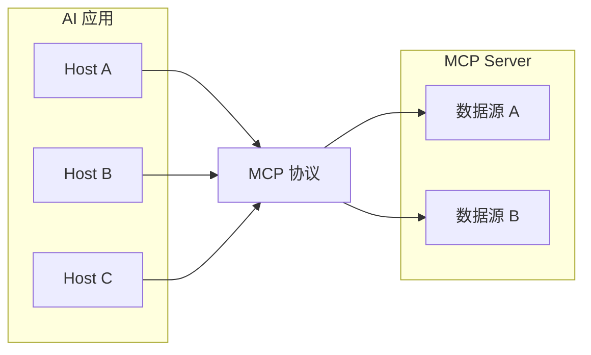

<div style="text-align: center; font-size: 2rem; font-weight: 700; margin-bottom: 0.5rem;"><strong>MCP 协议</strong></div>

# 1. MCP 是什么

**Model Context Protocol（模型上下文协议）** 是由 Anthropic 发起、社区共同推进的开放标准，用于在 **AI 应用（Host）** 与 **外部能力（MCP Server）** 之间，统一暴露 **工具调用、资源读取、提示模板** 等能力。可类比为「AI 侧的 USB-C」：**一次实现 Server，多处 Host 复用**，降低重复集成成本。

规范与生态入口见 [modelcontextprotocol.io](https://modelcontextprotocol.io)；具体修订版本以官网当前 **Specification** 为准。

# 2. 为什么需要 MCP

## 2.1. 集成成本：从 N×M 到 N+M

没有统一协议时，每个 Host（IDE、桌面助手、自研 Agent）都要为每个数据源单独适配，集成次数近似 **应用数 × 数据源数**。MCP 把「如何描述工具、如何传参、如何取资源」标准化后，新增一个 Server 可被多个 Host 连接，新增一个 Host 可复用已有 Server 生态，整体更接近 **N+M** 的线性成本。



## 2.2. 与「插件、RAG、Function Calling」的关系

MCP **不替代** RAG 或各家 Function Calling，而是提供 **可发现、可组合、可独立部署** 的工具与资源边界：RAG 仍负责语义检索；模型侧仍可能是 OpenAI / Anthropic 等格式的 tool 调用；MCP 负责 **Host↔Server 之间的协议与生命周期**。

# 3. 核心架构与能力

## 3.1. Host / Client / Server

- **Host**：承载 LLM 与用户体验的应用（如 Claude Desktop、Cursor、自研 Agent）。
- **MCP Client**：与 **单个** Server 维持 1:1 连接，负责 JSON-RPC 消息与路由；一个 Host 内可挂多个 Client，从而连多个 Server。
- **MCP Server**：实现具体能力，访问文件系统、数据库、SaaS API 等；对外只暴露协议规定的能力面。

## 3.2. 三大能力面

| 能力 | 作用 | 典型用途 |
|------|------|----------|
| **Tools** | 模型通过结构化 tool 调用触发，Server 执行后返回结果 | 读文件、查库、调内部 API |
| **Resources** | 用 **URI** 标识可读上下文 | 引用某文档版本、某工单快照 |
| **Prompts** | 可参数化的提示模板 | 团队统一审查清单、SQL 生成范式 |

## 3.3. 传输方式

常见 **stdio**（本地子进程）、**HTTP + SSE**、**WebSocket**（远程或需双向流）。选型取决于部署位置（本机 / 内网 / 托管远程 Server）与 Host 支持矩阵。

# 4. 典型会话流程

1. Client 与 Server 建立连接并完成握手。  
2. Server 返回当前可用的 tools / resources / prompts 及 **JSON Schema**。  
3. Host 将用户消息与能力描述一并交给 LLM。  
4. LLM 若需外部能力，返回 **tool 调用**（或等价结构）。  
5. Client 将调用转发给对应 Server，Server 执行业务逻辑并返回结果。  
6. Host 把结果写回对话，模型生成最终答复；可循环多轮。

协议层多为 **JSON-RPC 2.0** 消息；具体方法名与字段以当前规范为准。

# 5. MCP 与原生 Function Calling

| 维度 | 原生 Function Calling | MCP |
|------|------------------------|-----|
| 规范 | 常随模型 / SDK 变化 | 统一协议与能力发现 |
| 执行位置 | 多在应用进程内嵌 | 独立进程或服务，易做权限隔离 |
| 复用 | 每应用常重复实现 | Server 一次编写，多 Host 连接 |
| 资源与模板 | 常需自建 | Resources / Prompts 为一等能力 |
| 运维 | 随应用版本发布 | Server 可独立升级、限流、审计 |

实践上二者常 **并存**：底层仍可由 MCP Server 实现工具，Host 再把工具列表映射成当前模型认识的 function schema。

# 6. 隐私与数据边界

## 6.1. 「数据不出本地」的准确含义

**云端 LLM + 本地 MCP Server** 时：原始库表、文件内容可在本地 Server 内处理，但 **模型输入中仍会包含工具返回的摘要或片段**，且请求需到达云端模型服务。若要求 **全链路不出内网**，需要 **本地/私有化模型 + 本地 Host** 与网络策略配合。

## 6.2. 企业 SaaS 场景

数据源本身在 Jira、飞书、Confluence 等云端时，MCP 的价值更多是 **减少无效粘贴、结构化拉取、权限与审计收口**，而不是「数据原本不在云端」。

# 7. 搭建与接入要点

## 7.1. 实现 Server

1. 选用官方或社区 **SDK**（TypeScript、Python 等），实现工具列表、调用处理与错误模型。  
2. **最小闭环**：先 1～2 个只读工具打通 list → call → 回传。  
3. **Schema**：参数类型、枚举、边界写清楚，降低模型误调用。  
4. **可观测性**：记录 tool 名、耗时、错误码；日志中 **禁止** 打印密钥与 PII 原文。

## 7.2. Host 侧配置

在 Cursor、Claude Desktop 或自研 Agent 的配置中注册 Server 启动命令（如 `npx`、`uv run`）、工作目录与环境变量。具体键名与 UI 以各产品文档为准。

## 7.3. 官方示例 Server

常用能力（文件系统、Git、数据库等）可参考社区仓库 [modelcontextprotocol/servers](https://github.com/modelcontextprotocol/servers) 中的说明；**包名与启动参数会随版本变更**，接入前以该仓库 README 为准。

示例（仅作形态说明，命令请对照官方文档）：

```bash
npx -y @modelcontextprotocol/server-filesystem /path/to/allowed/dir
```

# 8. 多 Server 编排（示例）

按 **领域拆分 Server** 便于权限与发布节奏隔离，例如：交易（高敏感）、行情（只读高频）、资讯（合规与版权）分进程或分配置。Host 侧建议：

- **按会话阶段挂载工具子集**，避免一次性向上下文塞入过多 tool 描述。  
- 工具名加 **前缀**（如 `market_` / `news_`）避免跨 Server 重名。  
- 全链路携带 **trace_id**，便于审计跨 Server 调用链。

# 9. 典型应用场景（简表）

| 场景 | 目标 | Server 侧重 |
|------|------|-------------|
| 代码智能体 | 读写仓库、Git、有限终端 | Filesystem、Git、项目定制 |
| 个人知识库 | 笔记检索与整理 | Obsidian / 本地 Markdown 等 |
| 企业协同 | 工单、文档、IM | 官方托管或自托管 SaaS MCP |

架构共性均为 **Client → MCP Server → 真实系统**；差异在认证、网络边界与合规要求。

# 10. 优势、局限与趋势

**优势**：生态与示例 Server 丰富；工具与资源 **可组合**；易于做 **进程级隔离** 与最小权限；与 IDE 类产品集成路径清晰。

**局限**：多一跳 RPC 带来 **延迟**；权限、沙箱与供应链安全仍在快速演进；不同模型厂商对 MCP 的 **一等支持程度** 不一致，需在工程上预留适配层。

**趋势**：更强调 **审计、细粒度授权** 与 **Registry / 发现机制**；部分产品探索「由模型生成代码再调 MCP」以降低上下文中的 tool 元数据体积（实现方式因产品而异）。

# 11. 踩坑记录

- **stdio 阻塞**：长耗时工具阻塞 Client；宜异步任务化（先返 task id，再轮询/推送进度）或限制超时。  
- **超大 tool 返回**：原始 JSON 撑爆上下文 → Server 侧 **聚合、截断、摘要** 后再返回。  
- **协议与 SDK 版本漂移**：锁定依赖并在 CI 做兼容性冒烟。  
- **误以为 MCP 等于合规**：云端模型仍可能看到工具输出摘要，需按数据分级设计。  
- **工具重名**：多 Server 并存时必须前缀或命名空间约定。

# 12. 参考资料

- [Model Context Protocol 规范（官网）](https://modelcontextprotocol.io)  
- [modelcontextprotocol 组织（GitHub）](https://github.com/modelcontextprotocol)  
- [Anthropic：Model Context Protocol 公告](https://www.anthropic.com/news/model-context-protocol)  
- [MCP Servers 示例仓库](https://github.com/modelcontextprotocol/servers)  
